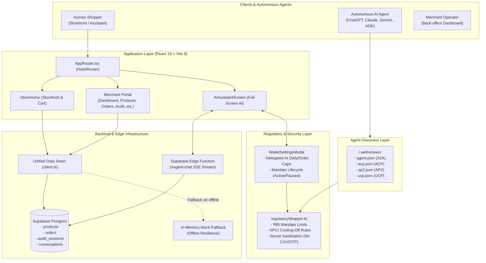
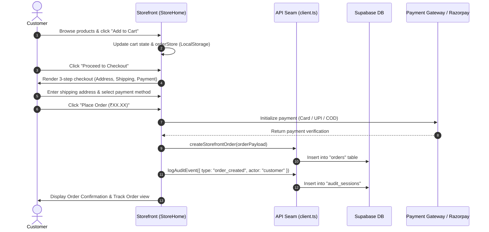
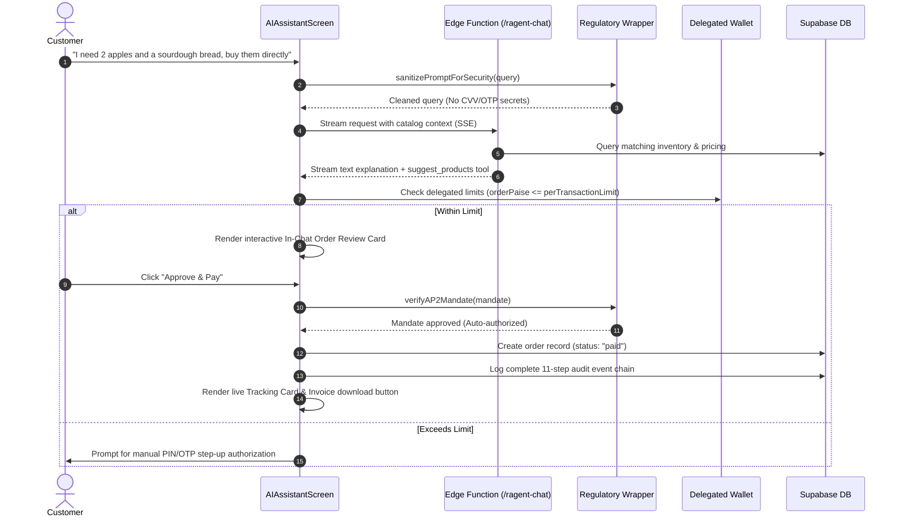
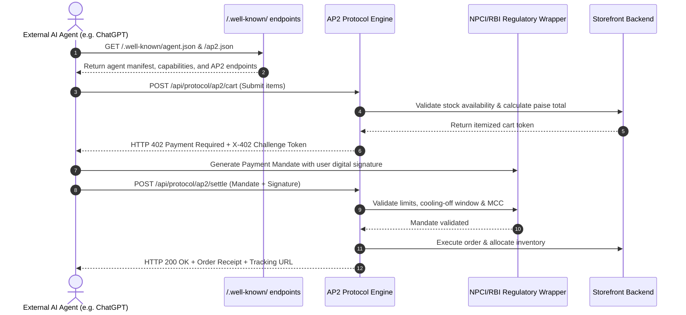
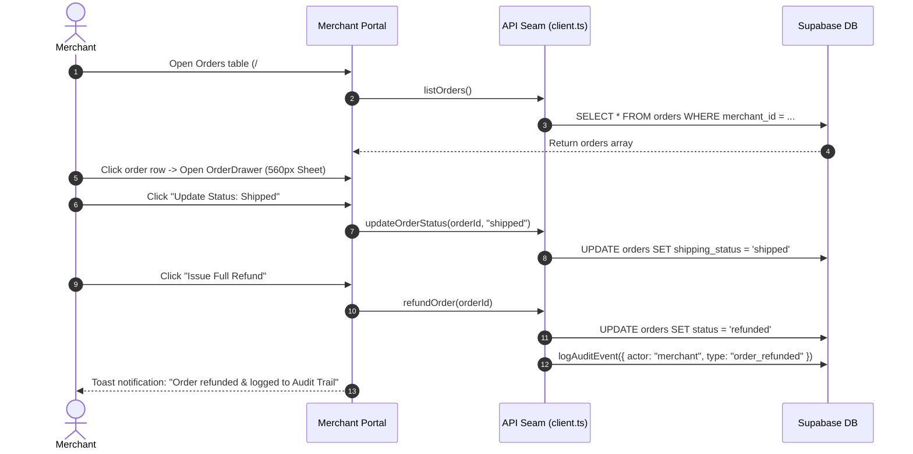

# Razent — Agentic Commerce & Instant Retail Platform

[](https://vitejs.dev/)
[](https://react.dev/)
[](https://www.typescriptlang.org/)
[](https://tailwindcss.com/)
[](https://ui.shadcn.com/)
[](https://supabase.com/)
[](https://github.com/google-agentic-commerce/AP2)
[](https://www.npci.org.in/)
[](https://www.rbi.org.in/)

Razent is an **Agentic Commerce and Instant Retail Platform**. It bridges traditional high-converting consumer grocery and retail storefronts with next-generation autonomous AI agents (ChatGPT, Claude, Gemini, and custom agents). Razent natively supports **Google Agent Payment Protocol (AP2)**, **Agentic Commerce Protocol (ACP)**, **Universal Commerce Protocol (UCP)**, and **NPCI / RBI payment regulatory compliance wrappers**.

---

## Table of Contents

- [1. Executive Overview](#1-executive-overview)
- [2. High-Level Architecture](#2-high-level-architecture)
- [3. Core Platform Capabilities](#3-core-platform-capabilities)
  - [3.1 Customer Storefront (`StoreHome`)](#31-customer-storefront-storehome)
  - [3.2 Dedicated Full-Screen AI Shopping Assistant](#32-dedicated-full-screen-ai-shopping-assistant)
  - [3.3 Delegated AI Wallet & NPCI/RBI Regulatory Wrapper](#33-delegated-ai-wallet--npcirbi-regulatory-wrapper)
  - [3.4 Agentic Protocols & Discovery Endpoints (A2A / AP2 / ACP / UCP)](#34-agentic-protocols--discovery-endpoints-a2a--ap2--acp--ucp)
  - [3.5 Merchant Operations & Intelligence Hub](#35-merchant-operations--intelligence-hub)
  - [3.6 Cryptographic Audit Trail System](#36-cryptographic-audit-trail-system)
- [4. Transaction & Execution Flows](#4-transaction--execution-flows)
  - [Flow 1: Human Shopper Instant Storefront Checkout](#flow-1-human-shopper-instant-storefront-checkout)
  - [Flow 2: Conversational AI Autonomous Purchase](#flow-2-conversational-ai-autonomous-purchase)
  - [Flow 3: External AI Agent-to-Agent (A2A) AP2 Protocol Purchase](#flow-3-external-ai-agent-to-agent-a2a-ap2-protocol-purchase)
  - [Flow 4: Merchant Order Fulfillment & Refund with Audit Trace](#flow-4-merchant-order-fulfillment--refund-with-audit-trace)
- [5. Test Credentials & Sandboxed Payment Verification](#5-test-credentials--sandboxed-payment-verification)
- [6. Directory Structure](#6-directory-structure)
- [7. Data Layer & API Architecture](#7-data-layer--api-architecture)
- [8. Security, Privacy & Regulatory Guardrails](#8-security-privacy--regulatory-guardrails)
- [9. Getting Started & Development](#9-getting-started--development)

---

## 1. Executive Overview

Modern e-commerce is rapidly transforming from manual browsing to **delegated agentic purchasing**, where humans instruct AI assistants to source, negotiate, and purchase items autonomously. 

Razent solves the three fundamental challenges of agentic retail:
1. **Agent Discovery & Protocol Interoperability**: Autonomous agents can inspect standard `.well-known` endpoints (`agent.json`, `acp.json`, `ap2.json`, `ucp.json`) to understand product catalogs, fees, delivery SLAs, and payment mandates.
2. **Financial Safety & Regulatory Governance**: Enforces **Reserve Bank of India (RBI) e-mandate rules** and **NPCI UPI AutoPay guidelines**, including delegated spending caps, cooling-off periods, zero secret ingestion (CVV/OTP protection), and mandate lifecycles.
3. **Unified Retail Infrastructure**: Both human shoppers and autonomous agents interact with the exact same real-time product inventory, pricing, order fulfillment pipeline, and merchant intelligence back-office.

---

## 2. High-Level Architecture



---

## 3. Core Platform Capabilities

### 3.1 Customer Storefront (`StoreHome`)
- **Route**: `/#/`
- **Catalog Browsing**: Rich product grid with instant search across titles, descriptions, and tags. Filter by categories: *Groceries, Fruits, Vegetables, Dairy & Bakery, Snacks & Munchies, Beverages, Household*.
- **Stock Indicators & Badges**: Dynamic badges for *In Stock*, *Low Stock (< 10 units)*, *Out of Stock*, and *Bestseller*.
- **Interactive Product Quick View**: Slide-out drawer displaying high-resolution gallery thumbnails, itemized nutritional/product specs, price in paise formatted to INR (`₹`), and real-time inventory count.
- **Cart & Persistence**: Cart items stay synchronized across tabs and refreshes via `orderStore` (LocalStorage) and React state.
- **Integrated AI Split Workspace**: On desktop, users can toggle a persistent right-hand AI shopping drawer while browsing products side-by-side.
- **Instant Checkout Flow**: 3-step checkout with delivery address entry, contact validation, payment method selector (Cards, UPI, Netbanking, COD), order summary, and breakdown (Subtotal, Delivery Fee, 18% GST).
- **Automated Tax Invoice Generation**: Built-in modal rendering a professional, downloadable GST Tax Invoice (`INV-XXXXXX`) with merchant GSTIN, HSN codes, and itemized tax breakdowns.

### 3.2 Dedicated Full-Screen AI Shopping Assistant
- **Route**: `/#/assistant`
- **Distraction-Free Conversational UI**: Dedicated full-screen ChatGPT/Gemini-style workspace adhering to modern dark/light system tokens with zero chat history clutter.
- **SSE Streaming & Catalog Grounding**: Communicates with the Supabase Edge Function `ragent-chat` via Server-Sent Events (SSE). Queries are resolved against the active inventory database to prevent hallucinations.
- **Dynamic In-Chat Product Cards**: The assistant streams structured JSON tool results into interactive product carousels with product images, prices, stock levels, and instant *"Add to Cart"* buttons.
- **In-Chat Order Review & Approval Cards**: When the user asks to purchase items, the assistant computes itemized pricing, checks stock availability, verifies spending bounds, and renders an embedded **Order Review Card**.
- **Autonomous Checkout**: Clicking *"Approve & Pay"* triggers payment authorization, generates an invoice, assigns hyperlocal logistics delivery, logs audit events, and transitions to order tracking without leaving the conversation.
- **Voice & Quick Prompts**: Quick prompt chips (*"Find fresh fruits under ₹500"*, *"Need dinner ingredients for 4"*, *"Healthy snacks"*) and microphone speech input simulation.

### 3.3 Delegated AI Wallet & NPCI/RBI Regulatory Wrapper
- **Accessible via**: AI Assistant Header (*Wallet Button*) or direct settings.
- **Delegated Autonomous Spending Limits**:
  - Max per-transaction limit (default: ₹2,000; configurable up to ₹15,000).
  - Daily spending cap (default: ₹5,000; configurable up to ₹50,000).
  - Explicit customer gating: orders exceeding the cap require immediate step-up manual PIN/OTP authorization.
- **RBI e-Mandate Compliance**:
  - Enforces minimum 24-hour cooling-off periods for recurring automated debit registrations.
  - Granular mandate states: `ACTIVE`, `PAUSED`, `REVOKED`.
  - Immediate mandate revocation with instant audit logging.
- **NPCI UPI AutoPay Framework**:
  - Validates merchant Category Code (MCC 5411 for Groceries/Supermarkets).
  - Handles auto-debit registration tokens and recurring execution windows.
- **Zero-Secret Ingestion Security Guardrail**:
  - `regulatoryWrapper.sanitizePromptForSecurity()` actively intercepts any prompt containing CVV numbers (3-4 digits), full credit/debit card numbers (15-16 digits matching Luhn algorithm), banking PINs, or OTPs.
  - Refuses transmission of sensitive payment credentials to LLMs or third-party gateways.

### 3.4 Agentic Protocols & Discovery Endpoints (A2A / AP2 / ACP / UCP)
Razent exposes standardized JSON manifests in `public/.well-known/` for cross-platform agentic commerce:

| Endpoint | Protocol | Description |
|---|---|---|
| `/.well-known/agent.json` | **Agent-to-Agent (A2A)** | Manifest detailing Razent's AI agent identity, supported skills (`catalog_search`, `cart_management`, `order_creation`), tool endpoints, and permissions. |
| `/.well-known/acp.json` | **Agentic Commerce Protocol (ACP)** | Protocol discovery describing catalog endpoints, payment schemes (`razorpay_uap`, `ap2_mandate`), supported currencies (`INR`), and webhook hooks. |
| `/.well-known/ap2.json` | **Google AP2** | AP2 specification configuration: supported payment mandate versions (`v1`, `v2`), cryptographic signature schemes (`Ed25519`, `ECDSA_P256`), and X-402 challenge mechanisms. |
| `/.well-known/ucp.json` | **Universal Commerce Protocol** | Capability discovery for multi-agent retail networks and cross-store federations. |

### 3.5 Merchant Operations & Intelligence Hub
- **Route**: `/#/merchant/*` (Protected by role verification and session management)
- **Merchant Navigation Shell (`AppShell`)**: Slim fixed sidebar (`14.5rem`), breadcrumbs, theme switcher, and instant role toggle.
- **8 Dedicated Merchant Screens**:
  1. **Dashboard (`/#/merchant/dashboard`)**: KPI metric cards with deltas (*Monthly Revenue, Orders Today, Active Conversations, Conversion Rate, Low Stock Alerts*), sales revenue area chart, category share donut chart, conversion funnel, recent orders table, and CSV report export.
  2. **Products (`/#/merchant/products`)**: Filterable product inventory table with image preview, stock status, category filters, quick stock adjust, and 560px `ProductDrawer` with 4 tabs (*Overview, Inventory, AI & Visibility, Activity*).
  3. **Product Import (`/#/merchant/product-import`)**: Bulk file ingestion supporting `.csv` and `.xlsx` formats with validation preview, downloadable sample templates, and manual row-by-row item builder.
  4. **Orders (`/#/merchant/orders`)**: Complete orders ledger with status pills (`created`, `paid`, `refunded`, `failed`), shipping status (`pending`, `packed`, `shipped`, `delivered`), search by customer/ID, and 560px `OrderDrawer` with 7 inspection sections.
  5. **Analytics (`/#/merchant/analytics`)**: Deep business intelligence with daily revenue trajectories, order status distributions, average order value (AOV) tracking, and AI-assisted vs direct purchase comparison.
  6. **AI Agent Operations (`/#/merchant/ai-agent`)**: Live conversation monitor showing real-time customer dialogues, agent intents, sentiment analysis, product suggestion rates, and conversation reset controls.
  7. **Audit Trail (`/#/merchant/audit-trail`)**: Immutable audit session table with actor badges (*Customer, AI Assistant, Merchant, System*), source indicators, and 560px `AuditDrawer` with cryptographic event payloads.
  8. **Settings (`/#/merchant/settings`)**: Merchant store configuration covering store identity, business details, tax GSTIN, AI agent operational constraints, shipping SLAs, and notification preferences.

### 3.6 Cryptographic Audit Trail System
- Every transaction, agent prompt, tool execution, payment status transition, and administrative refund is logged via `logAuditEvent()` in `src/lib/api/client.ts`.
- Audit sessions group sequential events with unique cryptographic identifiers, source categorization (`store`, `AI Agent`, `AI Assistant`, `Razorpay`, `NPCI UAP`, `Edge Function`), and outcome statuses (`Success`, `Warning`, `Failed`, `Critical`).

---

## 4. Transaction & Execution Flows

### Flow 1: Human Shopper Instant Storefront Checkout



---

### Flow 2: Conversational AI Autonomous Purchase



---

### Flow 3: External AI Agent-to-Agent (A2A) AP2 Protocol Purchase



---

### Flow 4: Merchant Order Fulfillment & Refund with Audit Trace



---

## 5. Test Credentials & Sandboxed Payment Verification

For developers, automated agents, and QA testers, Razent ships with pre-configured sandbox test credentials built into the platform:

### 5.1 Default Test Cards
| Card Network | Card Number | Card Type | Sub Type | Expiry & CVV |
|---|---|---|---|---|
| **Visa** | `4100 2800 0000 1007` | Debit | Consumer | Any future date (e.g. `12/28`), any 3-digit CVV (e.g. `123`) |
| **Mastercard** | `5555 5100 0008 1006` | Credit | Business | Any future date, any 3-digit CVV |
| **Mastercard** | `5180 2872 0009 1001` | Prepaid | Consumer | Any future date, any 3-digit CVV |
| **RuPay** | `6527 6589 0000 1005` | Credit | Consumer | Any future date, any 3-digit CVV |
| **Diners Club**| `3608 280009 1007` | Credit | Consumer | Any future date, any 3-digit CVV |
| **American Express**| `3402 560004 01007` | Credit | Consumer | Any future date, any 4-digit CVV |

### 5.2 Test UPI Virtual Payment Addresses (VPA)
- **Immediate Payment Success**: `success@razorpay`  
  *Triggers instant UPI verification, generates order ID, and launches dispatch logistics.*
- **Simulated Payment Failure**: `failure@razorpay`  
  *Simulates bank decline, expired UPI session, or insufficient account balance with user-friendly retry states.*

---

## 6. Directory Structure

```
Razent/
├── public/
│   ├── .well-known/
│   │   ├── agent.json                  # Agent-to-Agent (A2A) protocol manifest
│   │   ├── acp.json                    # Agentic Commerce Protocol discovery
│   │   ├── ap2.json                    # Google AP2 protocol configuration
│   │   └── ucp.json                    # Universal Commerce Protocol discovery
│   ├── product-import-template.csv    # Sample CSV for bulk product import
│   └── product-import-template.xlsx   # Sample Excel for bulk product import
├── supabase/
│   ├── functions/
│   │   └── ragent-chat/
│   │       └── index.ts               # Deno Edge Function: SSE AI streaming & RAG
│   └── migrations/                    # SQL schema definitions and migrations
├── src/
│   ├── main.tsx                       # Application entrypoint & ThemeProvider
│   ├── AppRouter.tsx                  # HashRouter routing table
│   ├── App.tsx                        # Legacy root screen renderer
│   ├── index.css                      # Global theme tokens, variables & typography
│   ├── components/
│   │   ├── ui/                        # shadcn/ui primitives (base-mira)
│   │   │   ├── button.tsx, card.tsx, sheet.tsx, table.tsx, dialog.tsx, etc.
│   │   ├── shared/
│   │   │   ├── AppShell.tsx           # Dual-role shell: Store vs Merchant sidebar
│   │   │   ├── ThemeToggle.tsx        # Light/Dark/System theme switcher
│   │   │   └── PageHeader.tsx         # Standardized page title & action bar
│   │   ├── auth/
│   │   │   └── SignInScreen.tsx       # Merchant authentication & role manager
│   │   ├── customer/
│   │   │   ├── StoreHome/             # Customer storefront
│   │   │   │   ├── index.tsx          # Store catalog, cart drawer & instant checkout
│   │   │   │   └── InvoiceModal.tsx   # Printable GST Tax Invoice generator
│   │   │   └── AIAssistant/
│   │   │       ├── AIAssistantScreen.tsx # Standalone full-screen AI assistant
│   │   │       └── WalletSettingsModal.tsx # Delegated limits & NPCI wallet settings
│   │   └── merchant/                  # Back-office administration screens
│   │       ├── Dashboard/             # Merchant KPIs, charts & funnel analysis
│   │       ├── Products/              # Product catalog table & ProductDrawer
│   │       ├── ProductImport/         # CSV/Excel drag-and-drop batch importer
│   │       ├── Orders/                # Orders ledger, order details & refunds
│   │       ├── Analytics/             # Advanced business intelligence & charts
│   │       ├── AIAgent/               # Live customer conversation inspector
│   │       ├── AuditTrail/            # Regulatory & AP2 audit session explorer
│   │       └── Settings/              # Store identity, AI policies, shipping rules
│   ├── lib/
│   │   ├── api/
│   │   │   ├── client.ts              # UNIFIED API SEAM (all UI calls flow here)
│   │   │   └── supabase.ts            # Supabase database & authentication client
│   │   ├── protocol/
│   │   │   ├── ap2Types.ts            # AP2, ACP & UCP protocol type definitions
│   │   │   ├── agenticCommerce.ts     # Mandate validation & X-402 challenge flow
│   │   │   └── regulatoryWrapper.ts   # NPCI AutoPay & RBI compliance wrapper
│   │   ├── types/                     # TypeScript entity models
│   │   │   ├── product.ts             # Product & ProductStatus
│   │   │   ├── order.ts               # Order, OrderStatus & ShippingStatus
│   │   │   ├── conversation.ts        # Conversation, ChatMessage & AIMsg
│   │   │   ├── audit.ts               # AuditSession & AuditEvent
│   │   │   ├── kpi.ts                 # KPI & DashboardData
│   │   │   └── analytics.ts           # RevenuePoint & CategoryShare
│   │   ├── mock/                      # Resilient in-memory fallback datasets
│   │   │   ├── products.ts, orders.ts, conversations.ts, audit.ts, kpis.ts
│   │   └── storage/
│   │       └── orderStore.ts          # LocalStorage sync for client cart and orders
│   └── state/
│       ├── useUI.ts                   # Screen states, active roles, drawer controls
│       ├── useTheme.ts                # Light / Dark theme persistence
│       ├── useSettings.ts             # Merchant settings & storeProfile
│       ├── useMerchant.ts             # Authenticated merchant profile
│       └── useError.ts                # Toast notification & error interceptor
├── AI_BLUEPRINT.md                    # Engineering design document & single source of truth
├── package.json                       # Dependencies and scripts
├── tsconfig.json                      # TypeScript compiler configuration
└── vite.config.ts                     # Vite build configuration
```

---

## 7. Data Layer & API Architecture

### 7.1 Unified Data Seam (`src/lib/api/client.ts`)
The application avoids tight coupling between UI components and the database. Every screen communicates exclusively through `client.ts`:

- `listProducts(args)`: Fetches active inventory, applies search/category filters.
- `getProduct(id)`: Retrieves complete product detail by ID.
- `updateProduct(id, updates)`: Updates stock, pricing, status, or descriptions.
- `listOrders(args)`: Fetches orders scoped to the active merchant.
- `getOrder(id)`: Retrieves single order with full itemization.
- `updateOrderStatus(orderId, status)`: Transitions order status (`paid`, `shipped`, `refunded`).
- `refundOrder(orderId)`: Issues refund and automatically logs a merchant audit event.
- `trackOrder(query)`: Public customer lookup by Order ID or phone number.
- `subscribeToProducts(callback)`: Real-time Supabase channel updating stock live across connected clients.
- `logAuditEvent(input)`: Cryptographic session logger for customer, merchant, and AI agent actions.
- `listAuditSessions(args)`: Retrieves audit logs for the regulatory inspector.
- `getDashboardData()`: Aggregates KPIs, sales trajectory, and attention items.
- `getAnalyticsData()`: Synthesizes revenue series, category share, and conversion metrics.

### 7.2 In-Memory Fallback Resilience
If Supabase credentials are missing or the backend is temporarily unreachable, `client.ts` automatically catches errors and returns rich in-memory mock datasets (`src/lib/mock/*`). This ensures the application never crashes and remains fully testable offline.

### 7.3 Paise Financial Standard
All currency is strictly stored and calculated in **paise** (1 INR = 100 paise) to adhere to banking and Razorpay conventions:
- Prevents JavaScript floating-point rounding errors (e.g. `0.1 + 0.2 !== 0.3`).
- All formatting uses `formatPrice(paise: number)` returning formatted rupee strings (e.g. `14900` -> `₹149`).

---

## 8. Security, Privacy & Regulatory Guardrails

1. **Zero Secret Ingestion**:
   - The platform strictly enforces automated prompt sanitization (`regulatoryWrapper.ts`).
   - CVV codes, bank PINs, OTPs, and complete card PANs are immediately intercepted and stripped before queries reach AI models or network logs.
2. **Autonomous Spending Safeguards**:
   - The AI assistant cannot execute orders exceeding the customer's configured `perTransactionLimit` or `dailyLimit` without explicit manual confirmation.
3. **RBI e-Mandate Compliance**:
   - Automated recurring payments require advance pre-debit notifications and a 24-hour cooling-off window.
   - Mandates can be paused or revoked with a single click in the customer's wallet.
4. **Audit Immutability**:
   - All critical actions generate an immutable trace containing actor, source, result, timestamp, and payload summary.

---

## 9. Getting Started & Development

### 9.1 Prerequisites
- **Node.js**: v20.x or higher
- **Package Manager**: `npm` or `pnpm`

### 9.2 Installation
```bash
# Clone the repository
git clone https://github.com/Hemalpawra/Razent.git
cd Razent

# Install dependencies
npm install
```

### 9.3 Environment Configuration (Optional)
Create a `.env` file in the project root if connecting to a live Supabase backend:
```env
VITE_SUPABASE_URL=https://your-project.supabase.co
VITE_SUPABASE_ANON_KEY=your-anon-key
```
*(Note: If omitted, Razent runs in resilient offline sandbox mode using in-memory mock data).*

### 9.4 Running Locally
```bash
# Start Vite development server
npm run dev

# Or specify custom port and host
npx vite --port 8443 --host 0.0.0.0
```
Open your browser at `http://localhost:8443`.

### 9.5 Key Application Routes
- `http://localhost:8443/#/` — Customer Grocery & Retail Storefront
- `http://localhost:8443/#/assistant` — Dedicated Full-Screen AI Shopping Assistant
- `http://localhost:8443/#/signin` — Merchant Back-Office Login
- `http://localhost:8443/#/merchant/dashboard` — Merchant KPI & Operations Dashboard
- `http://localhost:8443/#/merchant/orders` — Orders Management & Fulfillment
- `http://localhost:8443/#/merchant/audit-trail` — Regulatory & Protocol Audit Log Explorer

### 9.6 Type Checking & Production Build
```bash
# Run TypeScript type check
npx tsc --noEmit

# Build production bundle
npm run build
```

---

## License

This project is licensed under the MIT License. Built with ❤️ for the future of Agentic Commerce.
